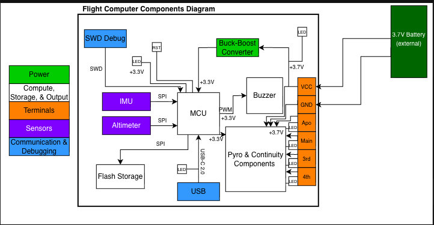

# SARP SRAD Flight Computer, 2026-2027

## Overview

In previous years, SARP relied on commercially available off-the-shelf (COTS) flight computers for its recovery systems. However, in pursuit of technical rigor and control over its systems, SARP has begun developing a student-researched-and-developed (SRAD) flight computer. Though SARP will continue using COTS flight computers for the 2026-2027 academic year, we hope to use them in tandem with our SRAD flight computer, such that the progress we make this year may set the stage for continued development in future years. 

This README gives an overview of our 2026-2027 SRAD flight computer, as well as relevant information for using, and contributing to this repository. 

## System Requirements

Our system requirements describe the constraints and criteria by which our system must adhere. 

| Statement of Requirement | Rationale |
|---|---|
| The flight computer shall estimate altitude and detect apogee using data from a barometric sensor and IMU. | Accurate flight-state detection. |
| The flight computer shall utilize a finite state machine and recognize the following states: Pre-Flight, Ascent, Descent, Idle Descent, and Post-Flight. | Provides a structured mechanism for flight-state detection. |
| The finite state machine shall detect a new state and begin performing the operations associated with that state within 1 second. | Enables timely execution of flight-critical events. |
| The flight computer shall be capable of igniting up to four e-matches at pre-specified times, altitudes, or flight events while in flight. | E-matches must be ignited at the appropriate time during flight. |
| The flight computer shall occupy an area no greater than three times the area of a Blue Raven altimeter, or 4.32 in². | Enables a small footprint for easy integration into the avionics bay. |
| The flight computer shall calculate and log altitude, velocity, acceleration, and angular-rate data, as well as each attempted e-match ignition. | Flight data is valuable for post-flight analysis by all subteams. |
| The flight computer shall provide relevant visual and audible cues indicating its current state, connected e-matches, and readiness for flight. | Enables verification of system status and arming. |
| Audible cues shall be at least 80 dB at a distance of 100 mm outside the rocket. | Supports IREC requirements for arming verification. |
| Visual cues shall be visible from a distance of 100 mm outside the rocket. | Supports IREC requirements for arming verification. |
| Audible and visual cues shall be understandable while the operator is wearing a face shield and foam earplugs. | Supports safe operation and IREC requirements during launch preparation. |
| The flight computer shall provide sufficient current to reliably ignite a connected e-match. | Necessary for successful recovery deployment. |
| The flight computer shall be powered by a battery that complies with applicable IREC rules. | Ensures competition compliance. |
| The flight computer shall undergo software-in-the-loop and hardware-in-the-loop testing to demonstrate successful data logging, event logic, and e-match ignition functionality. | Provides ground-based verification before flight. |
| The flight computer shall complete a tri-redundant test flight integrated into a recovery system with two Blue Raven altimeters. | Provides flight validation before use in a dual-redundant recovery configuration. |
| Pyrotechnic channels shall be electrically isolated from one another. | A failure in one channel should not cause a failure in another. |
| Pyrotechnic outputs shall default to a non-firing, safe state on power-up, power loss, or system reset. | Prevents unintended ignition. |

## Hardware

Functional, but simple, was the core philosophy that governed the design of our flight computer hardware. As such, our design features key sensors, such as a 6-axis IMU and barometer, but excludes more advanced features such as GPS and telemetry. Below, you can find a block diagram and list of critical components.

| Component | Part Number | Source |
|---|---|---|
| Microcontroller | STM32F411CEU6 | [JLCPCB](https://jlcpcb.com/partdetail/STMicroelectronics-STM32F411CEU6/C60420?jlc_vid=QAUPUlBSRVFdBVIEE1kNUlNXRVNaVAEDFQdeAVxQTlQxVlNeQFVZVlRXRlhaVDtW) |
| Barometer | BMP390 | [JLCPCB](https://jlcpcb.com/partdetail/BoschSensortec-BMP390/C5124834?jlc_vid=QAUPUlBSRVFdBVIEE1kNUlNXRVNaVAEDFQdeAVxQTlQxVlNeQFVZVlZTT1RZXjtW) |
| IMU | BMI088 | [JLCPCB](https://jlcpcb.com/partdetail/BoschSensortec-BMI088/C194919?jlc_vid=QAUPUlBSRVFdBVIEE1kNUlNXRVNaVAEDFQdeAVxQTlQxVlNeQFVZVlFfRVRaUDtW) |
| External Flash | W25Q128JVPIQ | [JLCPCB](https://jlcpcb.com/partdetail/WinbondElec-W25Q128JVPIQ/C190862?jlc_vid=FgBZAgVeRgdZUFQHR1JbVl1RQFQKAl1TT1RZVVcCRAIxVlNeQFReXldfRVVbVDtW) |
| USB-C Connector | TYPE-C-31-M-12 | [JLCPCB](https://jlcpcb.com/partdetail/Korean_HropartsElec-TYPE_C_31_M12/C165948?jlc_vid=FgBZAgVeRgdZUFQHR1JbVl1RQFQKAl1TT1RZVVcCRAIxVlNeQFRfUFVST1BdUTtW) |
| Piezo Buzzer | PS1240P02BT | [JLCPCB](https://jlcpcb.com/partdetail/TDK-PS1240P02BT/C76871?jlc_vid=FgBZAgVeRgdZUFQHR1JbVl1RQFQKAl1TT1RZVVcCRAIxVlNeQFRfX1BWQ1ZfUDtW) |

## Software

In order to put as much attention as possible towards the application layer of the flight computer software, a HAL for the STM32F4XX was generated using CubeMX. 

The application layer of the flight computer software revolves around a finite state machine, which dictates the operations the flight computer is performing at a given time during our rocket's launch. The state machine defines five distinct states:

| State | Description |
|---|---|
| **Pre-Flight** | The flight computer establishes reference values such as ground pressure, and provides status feedback before launch. |
| **Ascent** | Begins after launch is detected. The flight computer monitors sensor data, logs data to external flash memory, and detects apogee. Once apogee is detected the flight computer fires it's apogee pyro charge, and logs the time. |
| **Descent** | Begins after apogee is detected. After two seconds have passed since the apogee pyro charge was fired, the backup apogee charge is fired. The flight computer continues collecting sensor data and logging it to external flash. Simultaneously, it monitors it's altitude, and at a predetermined altitude it fires the main pyro charge and logs the time. |
| **Idle Descent** | Two seconds after the main pyro charge is fired, the backup main charge is fired. The flight computer continues logging flight data during its descent. |
| **Post-Flight** | Begins after the rocket is determined to be grounded. The flight computer stops logging data after 10 seconds, begins providing post-flight status feedback, and allows recorded data to be downloaded. |

## Contributing and Testing

## Contributors

| Role | Name | Areas of Impact |
|---|---|---|
| **Project Lead** | Jude Merritt | ... |
| **Hardware Member** | Andrew Winston | ... |
| **Software Member** | *Name* | ... |
| **Software Member** | *Name* | ... |